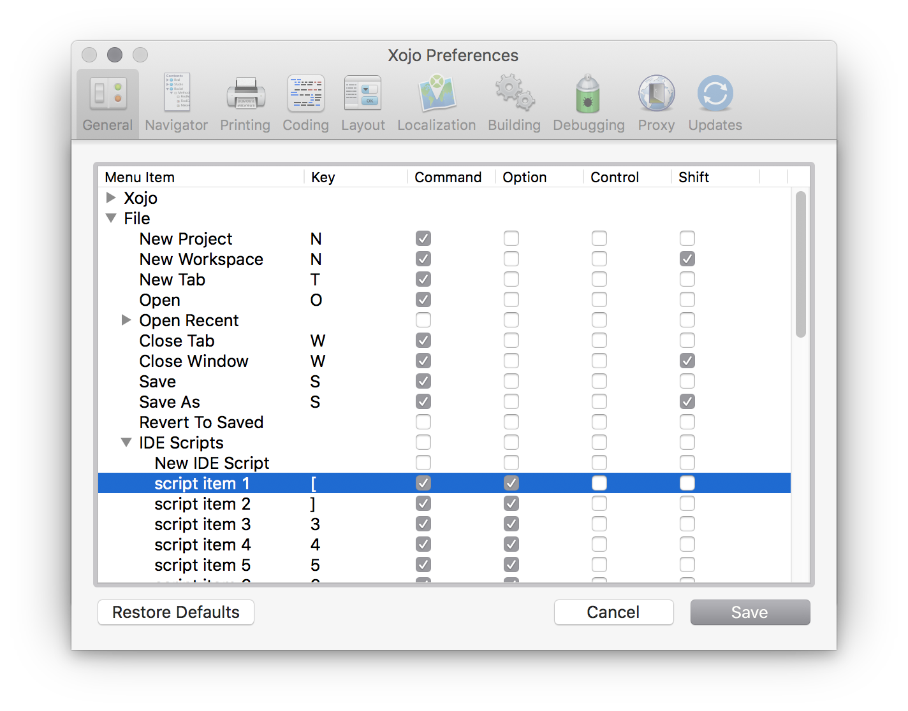

# Xojo Navigation Shortcut

Scripts to add keyboard shortcut to navigation.
Workaround until the feature is implemented by Xojo (<feedback://showreport?report_id=27289>).

1. Add `000_GoBack.xojo_script` and `000_GoForward.xojo_script` to the `Scripts` folder next to the Xojo application.
2. Configure keybaord shortcut (Preferences... > General > Menu short cuts) for these scripts.
   The example below assgins Command + Option + `[` / `]` to Back / Forward respectively.

